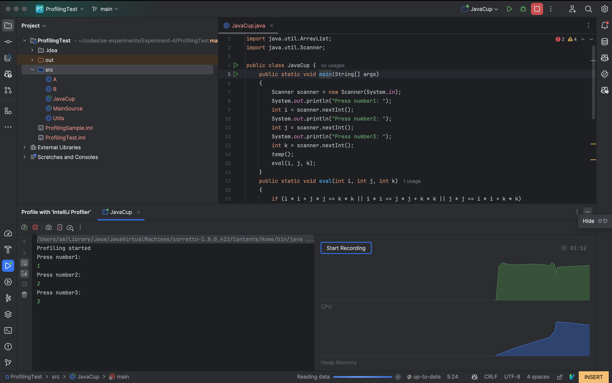
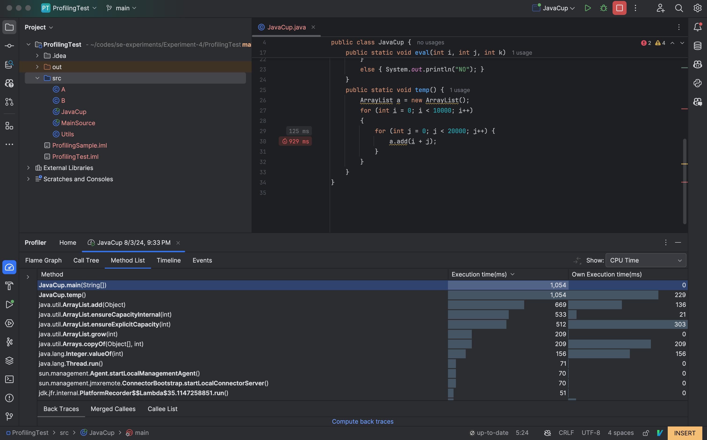
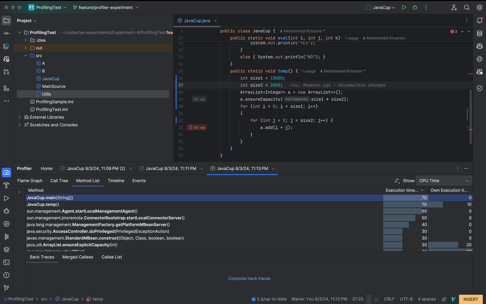
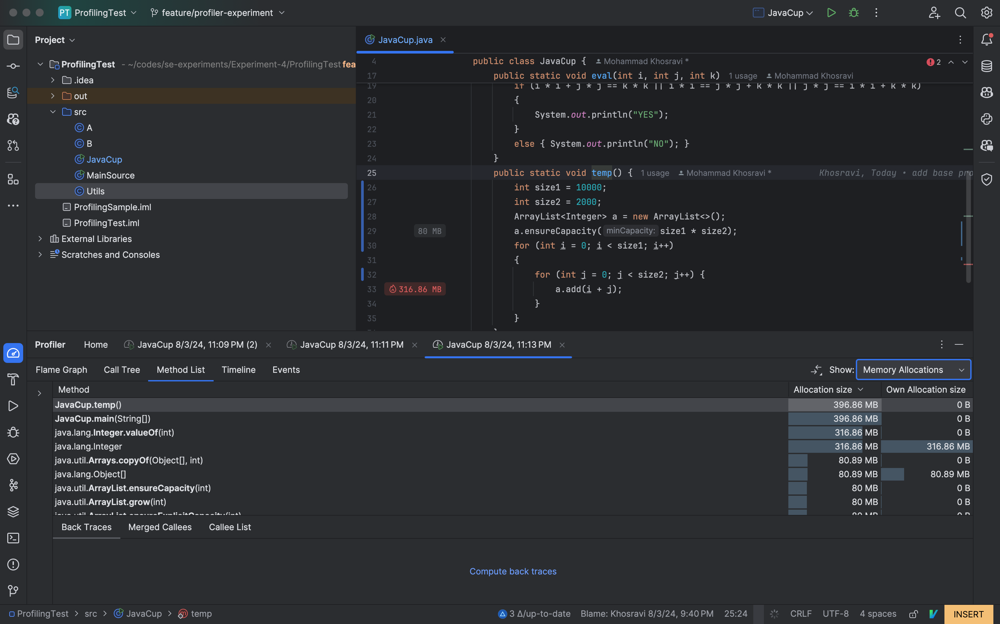

# Experiment-4

## آشنایی با نحوه پروفایل برنامه (Profiling)
پس از انجام مراحل نصب YourKit، 
و نصب افزونه آن در Intellij، 
عملیات Profiling را 
بر روی کلاس JavaCup
انجام می‌دهیم. نتایج اولیه را در عکس‌های زیر مشاهده می‌کنیم. 

توجه کنید که به علت بزرگ بودن اعداد مربوط به تعداد اجرای حلقه‌ها، مجبور شدیم که یک صفر از اندازه حلقه‌ی درونی کم کنیم تا در زمان معقولی بتوان آن را اجرا کرد!

همانطور که مشاهده می‌کنیم، تابع temp 
بیشترین میزان مصرف منابع را دارد. حال به گونه‌ای آن را تغییر می‌دهیم که مصرف منابع بهتر شود.
تغییر ما از جنس گرفتن فضای حافظه در همان اول شروع اجرای تابع است تا overhead زیاد کردن فضای حافظه را از بین ببریم.

که همانطور که مشاهده می‌کنید، هم زمان اجرا کاهش یافته است و هم مقدار حافظه مصرفی.
