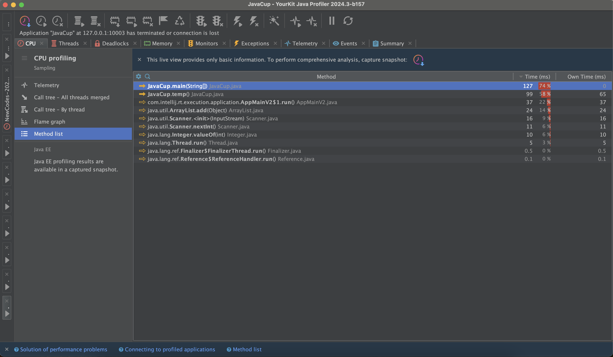
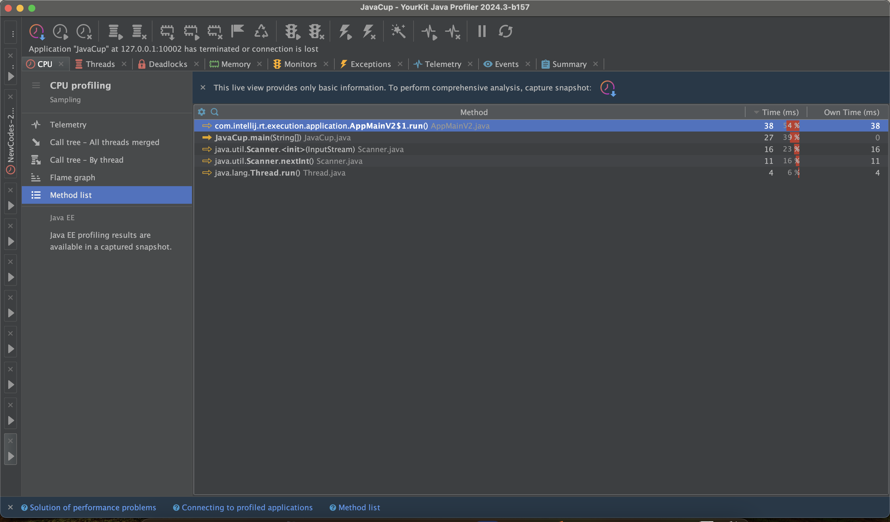

# Experiment-4

<div dir="rtl">

## آشنایی با نحوه پروفایل برنامه (Profiling)
  
پس از انجام مراحل نصب YourKit، 
و نصب افزونه آن در Intellij، 
عملیات Profiling را 
بر روی کلاس JavaCup
انجام می‌دهیم. نتایج اولیه را در عکس‌های زیر مشاهده می‌کنیم. 



توجه کنید که به علت بزرگ بودن اعداد مربوط به تعداد اجرای حلقه‌ها، مجبور شدیم که یک صفر از اندازه حلقه‌ی درونی کم کنیم تا در زمان معقولی بتوان آن را اجرا کرد!

همانطور که مشاهده می‌کنیم، تابع temp 
بیشترین میزان مصرف منابع را دارد. حال به گونه‌ای آن را تغییر می‌دهیم که مصرف منابع بهتر شود.
تغییر ما از جنس گرفتن فضای حافظه در همان اول شروع اجرای تابع است تا overhead زیاد کردن فضای حافظه را از بین ببریم. 



که همانطور که مشاهده می‌کنید، هم زمان اجرا کاهش یافته است و هم مقدار حافظه مصرفی.

---
## پیاده سازی الگوریتم Longest Common Sequence

رویکرد بازگشتی: این رویکرد مستقیماً از تعریف بازگشتی LCS پیروی می کند. هر کاراکتر هر دو رشته را بررسی می کند و به صورت بازگشتی LCS را برای مسئله کوچکتر پیدا می کند.

رویکرد برنامه‌ریزی پویا: در این روش با استفاده از برنامه‌ریزی پویا، یک آرایه دو بعدی پر می‌شود که L[i][j] طول زیر رشته‌های LCS را در دو رشته 
X[0..i−1]
و
Y[0..j−1]
نشان می‌دهد.


## تبدیل نیازمندی ها به موارد آزمون با استفاده از روش ایجاد مبتنی بر رفتار(BDD)
### بند اول
این بخش به طور کامل طبق فایل Example.pdf پیاده‌سازی شده و در پروژه قرار دارد.
### بند دوم
پس از نصب و راه‌اندازی پروژه و اضافه کردن Scenario Outline گفته شده برخی تست‌ها به مشکل Undefined می‌خورند.
تست مربوط به اعداد ۱- و ۶ است که برای خط Given به این ارور می‌خورد.
 به علت این رخداد این است که در عبارت منظمی که برای تست نوشته شده است، علامت منفی پشت عدد ۱- تعریف نشده است.
به همین علت است که این Given توسط تابعی که تعریف کرده‌ایم اجرا نمی‌شود.
برای رفع این مشکل کافی ست در عبارت منظم علامت منفی را هم در capturing group در نظر بگیریم:

<div dir="ltr">

```regexp
^Two input values, (-?\d+) and (-?\d+)$
```
<div dir="rtl">

### بند سوم
این بخش نیز به طور کامل و مشابه قبل پیاده‌سازی شده و داخل پروژه قرار دارد.
### بند چهارم
فایل گزارش داخل سامانه آموزش بارگزاری شده است.